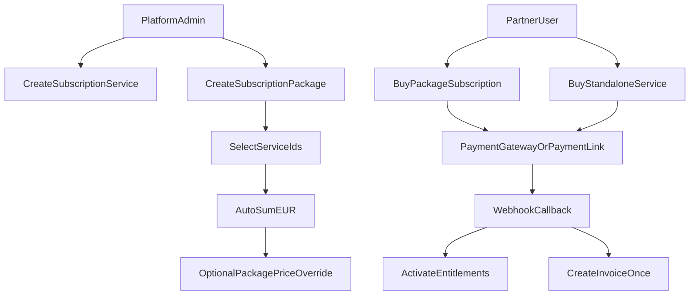

# Subscription Domain Rewrite Plan

## Scope And Decisions

- Hard cut migration: remove old plan-centric model/paths and replace with new domain now.
- Service icon support: removed completely (no icon field, no icon UI).
- Currency: EUR only for services/packages/subscription purchases.
- Trial: 15 days.

## What Will Be Rebuilt

- Replace static `SUBSCRIPTION_PLANS` with two explicit entities:
  - `SubscriptionService` (standalone purchasable service)
  - `SubscriptionPackage` (bundle of services, subscription-only)
- Keep one purchase timeline per partner, but split purchase intent/type:
  - `service_purchase` (one-time or recurring service)
  - `package_subscription` (yearly now, monthly-ready)

## Target Flow (Simplified)

## Backend Implementation Plan

- Create Subscription module:
  - [apps/api/src/modules/subscriptions/subscription-service.model.js](apps/api/src/modules/subscription-service/subscription-service.model.js)
  - [apps/api/src/modules/subscriptions/subscription-service.service.js](apps/api/src/modules/subscription-service/subscription-service.service.js)
  - [apps/api/src/modules/subscriptions/subscription-service.routes.js](apps/api/src/modules/subscription-service/subscription-service.routes.js)
  - [apps/api/src/modules/subscriptions/subscription-package.model.js](apps/api/src/modules/subscription-package/subscription-package.model.js)
  - [apps/api/src/modules/subscriptions/subscription-package.service.js](apps/api/src/modules/subscription-package/subscription-package.service.js)
  - [apps/api/src/modules/subscriptions/subscription-package.routes.js](apps/api/src/modules/subscription-package/subscription-package.routes.js)
- Register API paths in [apps/api/src/loaders/routes.js](apps/api/src/loaders/routes.js).
- Refactor partner subscription state in [apps/api/src/modules/partner/partner.model.js](apps/api/src/modules/partner/partner.model.js) to package/service based entitlements and 15-day trial.
- Refactor admin billing ops in [apps/api/src/modules/partner/partnerBilling.service.js](apps/api/src/modules/partner/partnerBilling.service.js):
  - package purchase creation
  - standalone service purchase creation
  - EUR enforcement
  - remove plan constants coupling
- Refactor partner self-payment in [apps/api/src/modules/my/my.service.js](apps/api/src/modules/my/my.service.js):
  - remove TRY conversion branch
  - enforce EUR
  - idempotent payment callback
  - fix invoice invocation and duplicate-invoice prevention
- Extend payment-link domain in [apps/api/src/modules/paymentLink/paymentLink.model.js](apps/api/src/modules/paymentLink/paymentLink.model.js) and [apps/api/src/modules/paymentLink/paymentLink.service.js](apps/api/src/modules/paymentLink/paymentLink.service.js) to support package/service purchases (not only booking).
- Keep payment-service callback contract compatible in [apps/payment-service/src/routes/payment.routes.js](apps/payment-service/src/routes/payment.routes.js), but route subscription/service payment-link completions cleanly.

## Frontend Implementation Plan

- Add Partners/Services management screen and modal:
  - [apps/admin/src/views/partners/ServicesView.vue](apps/admin/src/views/partners/ServicesView.vue)
  - [apps/admin/src/services/subscriptionServiceService.js](apps/admin/src/services/subscriptionServiceService.js)
- Add Partners/Packages management screen and package builder:
  - [apps/admin/src/views/partners/PackagesView.vue](apps/admin/src/views/partners/PackagesView.vue)
  - [apps/admin/src/services/subscriptionPackageService.js](apps/admin/src/services/subscriptionPackageService.js)
- Update routing/nav:
  - [apps/admin/src/router/index.js](apps/admin/src/router/index.js)
  - [apps/admin/src/views/PartnersView.vue](apps/admin/src/views/PartnersView.vue)
  - [apps/admin/src/views/partners/SubscriptionsView.vue](apps/admin/src/views/partners/SubscriptionsView.vue)
- Service modal UX rules:
  - use `MultiLangInput` for name/description from [apps/admin/src/components/common/MultiLangInput.vue](apps/admin/src/components/common/MultiLangInput.vue)
  - remove icon selector
  - EUR-only amount input (no currency dropdown)
- Package modal UX rules:
  - use `MultiLangInput`
  - multi-select services via dropdown/select component
  - auto-summed EUR price + optional override toggle
  - billing period dropdown prepared for yearly/monthly, yearly default active
- Refactor partner self-subscription page [apps/admin/src/views/MySubscriptionView.vue](apps/admin/src/views/MySubscriptionView.vue):
  - consume new service/package APIs
  - support standalone service purchase and package subscription in same account
  - support direct card flow and payment-link flow

## Cleanup / Purge (Hard Cut)

- Remove obsolete plan constant and old plan-dependent branches:
  - [apps/api/src/constants/subscriptionPlans.js](apps/api/src/constants/subscriptionPlans.js)
  - plan fallback/hardcoded data in:
    - [apps/admin/src/composables/usePartnerSubscription.js](apps/admin/src/composables/usePartnerSubscription.js)
    - [apps/admin/src/views/MySubscriptionView.vue](apps/admin/src/views/MySubscriptionView.vue)
    - [apps/admin/src/views/partners/SubscriptionsView.vue](apps/admin/src/views/partners/SubscriptionsView.vue)
- Remove USD/TRY/GBP selectors and all multi-currency paths for subscription/services.

## Verification Strategy

- API contract checks:
  - service CRUD, package CRUD, package-service linkage, EUR validation
  - trial period assignment (15 days)
- Payment checks:
  - direct card payment success/failure
  - payment-link generation and completion
  - callback idempotency (duplicate callback does not double-activate/double-invoice)
- UI checks:
  - service modal multilingual inputs + EUR only
  - package builder auto-price and override
  - partner can buy package + additional standalone service
- Final lint/type checks on touched files.

## Key Risk Controls

- Add unique guard for invoice creation per purchase reference.
- Ensure webhook key validation is strict (no weak fallback behavior in production path).
- Keep payment-service externalId format deterministic for both package and service purchases.
