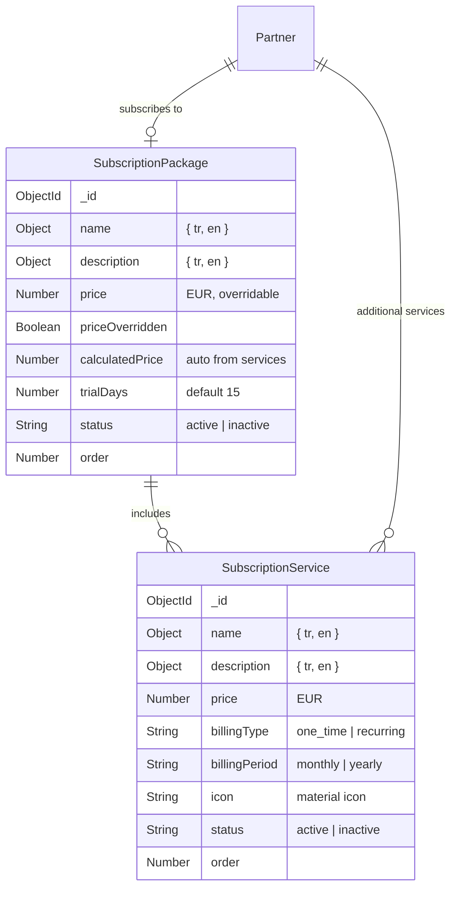

# Subscription System Redesign

## Current State

- 4 hardcoded plans in [subscriptionPlans.js](apps/api/src/constants/subscriptionPlans.js) (webdesign, business, professional, enterprise)
- No "Services" or "Packages" CRUD - everything is static
- Multi-currency support (USD/EUR/TRY/GBP) scattered across forms
- No trial period support
- Partner purchases reference plan string keys (`'webdesign'`, `'business'`, etc.)
- Subscription forms use plain text inputs instead of `MultiLangInput`

## Target Architecture



**Data flow:** Platform admin creates Services (priced in EUR) -> creates Packages (bundles of services, auto-priced or overridden) -> Partners subscribe to Packages and/or buy individual Services.

## Phase 1: Backend - New Models and APIs

### 1a. SubscriptionService module

Create via `pnpm create-module subscription-service --no-model` then manually build model.

**Model** (`apps/api/src/modules/subscription-service/subscription-service.model.js`):

- `name`: `{ tr: String, en: String }` (required)
- `description`: `{ tr: String, en: String }`
- `price`: `Number` (EUR, required)
- `billingType`: `enum ['one_time', 'recurring']` (required)
- `billingPeriod`: `enum ['monthly', 'yearly']` (only when recurring)
- `icon`: `String` (material icon name, optional)
- `status`: `enum ['active', 'inactive']`, default `'active'`
- `order`: `Number`, default `0`
- timestamps

**Routes** (admin-only, auto-mounted at `/api/subscription-services`):

- `GET /` - list all services
- `POST /` - create service
- `PUT /:id` - update service
- `DELETE /:id` - soft-delete (set inactive)

### 1b. SubscriptionPackage module

Create via `pnpm create-module subscription-package --no-model`.

**Model** (`apps/api/src/modules/subscription-package/subscription-package.model.js`):

- `name`: `{ tr: String, en: String }` (required)
- `description`: `{ tr: String, en: String }`
- `services`: `[{ service: ObjectId ref, included: Boolean }]`
- `price`: `Number` (EUR)
- `priceOverridden`: `Boolean`, default `false`
- `calculatedPrice`: `Number` (virtual, sum of service prices)
- `trialDays`: `Number`, default `15`
- `billingPeriods`: `[String]` enum subset of `['monthly', 'yearly']`, default `['yearly']`
- `badge`: `{ tr: String, en: String }` (e.g., "Popular")
- `status`: `enum ['active', 'inactive']`, default `'active'`
- `order`: `Number`, default `0`
- timestamps

**Routes** (admin-only, auto-mounted at `/api/subscription-packages`):

- `GET /` - list all packages (populate services)
- `GET /public` - public listing for partner self-service (active only)
- `POST /` - create package
- `PUT /:id` - update package
- `DELETE /:id` - soft-delete

### 1c. Update Partner model

In [partner.model.js](apps/api/src/modules/partner/partner.model.js), update the `subscription` subdocument:

- Add `subscription.package`: ObjectId ref to SubscriptionPackage
- Add `subscription.trialEndsAt`: Date
- Add `subscription.additionalServices[]`:
  - `service`: ObjectId ref to SubscriptionService
  - `status`: enum `['active', 'cancelled', 'expired']`
  - `purchasedAt`: Date
  - `price`: `{ amount: Number, currency: 'EUR' }`
  - `period`: `{ startDate, endDate }` (for recurring)
  - `payment`: `{ date, method, reference, notes }`
- Update `purchases[].plan` to also accept `purchases[].package` (ObjectId) for new purchases
- Keep old `plan` string field for backward compatibility with existing data
- Add `'trial'` to subscription status enum

### 1d. Update billing services

- [partnerBilling.service.js](apps/api/src/modules/partner/partnerBilling.service.js): Replace `SUBSCRIPTION_PLANS` lookups with DB package queries
- [my.service.js](apps/api/src/modules/my/my.service.js): Update `getMySubscription`, `initiatePurchase`, `payPendingPurchase` to use packages from DB
- Remove `getSubscriptionPlans` that returns hardcoded plans; replace with DB query
- Enforce EUR currency in all purchase/payment operations

### 1e. Deprecate subscriptionPlans.js

- Keep [subscriptionPlans.js](apps/api/src/constants/subscriptionPlans.js) temporarily for backward compat (old purchases referencing plan keys)
- Add a `getLegacyPlanName(planKey)` helper for old data
- New code exclusively uses package ObjectIds

### 1f. Route config

Add to [routes.js](apps/api/src/loaders/routes.js) ROUTE_CONFIG:

```
'subscription-service': 'subscription-services',
'subscription-package': 'subscription-packages'
```

## Phase 2: Frontend - Services CRUD

### 2a. New service file

Create `apps/admin/src/services/subscriptionServiceService.js` (API wrapper for `/subscription-services`).

### 2b. ServicesView

Create `apps/admin/src/views/partners/ServicesView.vue`:

- Shares `ModuleNavigation` tabs with Partners/Subscriptions/Services/Packages
- DataTable listing all services
- Create/Edit modal with:
  - `MultiLangInput` for name (tr/en)
  - `MultiLangInput` for description (tr/en, textarea)
  - Price input (EUR only, no currency selector)
  - Billing type dropdown (`one_time` / `recurring`)
  - Billing period dropdown (`monthly` / `yearly`, shown only when recurring)
  - Optional material icon selector (simple text input with preview)
  - Status toggle
  - Order number
- Delete confirmation

### 2c. Route registration

Add to [router/index.js](apps/admin/src/router/index.js):

```javascript
{ path: 'partners/services', component: ServicesView, meta: { requiresPlatformAdmin: true } }
{ path: 'partners/packages', component: PackagesView, meta: { requiresPlatformAdmin: true } }
```

### 2d. Update ModuleNavigation tabs

In [PartnersView.vue](apps/admin/src/views/PartnersView.vue), [SubscriptionsView.vue](apps/admin/src/views/partners/SubscriptionsView.vue), and the two new views, update `navItems` to:

- Partners | Subscriptions | Services | Packages

## Phase 3: Frontend - Packages CRUD

### 3a. New service file

Create `apps/admin/src/services/subscriptionPackageService.js`.

### 3b. PackagesView

Create `apps/admin/src/views/partners/PackagesView.vue`:

- DataTable listing all packages
- Create/Edit modal with:
  - `MultiLangInput` for name (tr/en)
  - `MultiLangInput` for description (tr/en, textarea)
  - Service selector (multi-select checkboxes from service list)
  - Auto-calculated price display (sum of selected services)
  - Price override toggle + manual price input (EUR)
  - Billing periods checkboxes (yearly checked by default; monthly for future)
  - Trial days input (default 15)
  - Optional badge (`MultiLangInput`, e.g., "Popular")
  - Status toggle
  - Order number

## Phase 4: Update Subscription Flow

### 4a. Update PartnersView subscription modal

In [PartnersView.vue](apps/admin/src/views/PartnersView.vue) and [usePartnerSubscription.js](apps/admin/src/composables/usePartnerSubscription.js):

- Replace hardcoded plan dropdown with dynamic package selector (from DB)
- Add "Additional Services" tab to subscription modal
- Remove multi-currency selectors; enforce EUR
- Show package details (included services, price)

### 4b. Update SubscriptionsView

In [SubscriptionsView.vue](apps/admin/src/views/partners/SubscriptionsView.vue):

- Replace hardcoded plan filter with dynamic package filter
- Update table columns for new data structure

### 4c. Update MySubscriptionView

In [MySubscriptionView.vue](apps/admin/src/views/MySubscriptionView.vue):

- Replace `availablePlans` hardcoded object with API call to get packages
- Show package services breakdown
- Add individual service purchase option
- Remove multi-currency; show EUR only
- Show trial status if applicable

### 4d. Update partner model helpers

In [partner.model.js](apps/api/src/modules/partner/partner.model.js):

- Update `getSubscriptionStatus()` to include package info
- Update `getCurrentPlan()` to resolve package
- Add trial period logic to `calculateSubscriptionStatus()`

## Phase 5: Cleanup and Audit

### 5a. Remove unnecessary code

- Remove currency selectors from all subscription forms
- Remove `PLAN_TYPES` array usage where replaced by DB packages
- Clean up [usePartnerSubscription.js](apps/admin/src/composables/usePartnerSubscription.js): remove fallback hardcoded plans in `loadSubscriptionPlans`
- Remove redundant `subscriptionStatusMap` duplications

### 5b. Simplify composable

The [usePartnerSubscription.js](apps/admin/src/composables/usePartnerSubscription.js) composable (491 lines) has complexity that can be reduced:

- Remove hardcoded plan fallbacks
- Consolidate form state management
- Remove unused `getProvisionedHotels` (always returns 0)

### 5c. EUR enforcement

- Backend: Validate `price.currency === 'EUR'` in all purchase endpoints
- Frontend: Remove currency dropdowns from all subscription forms
- Invoice generation: Default to EUR

## Phase 6: Payment Flow Verification

### 6a. Card payment flow

Verify end-to-end: `MySubscriptionView` card form -> `initiatePurchase` -> payment-service `/api/pay` -> 3D Secure iframe -> callback -> purchase activated.

### 6b. Admin mark-as-paid flow

Verify: Admin adds purchase -> marks paid -> invoice generated -> subscription activated.

### 6c. Payment link for subscriptions

Currently subscriptions have NO payment link support (only card form or admin mark-paid). Evaluate if payment link creation is needed for subscriptions. If so, extend `paymentLink` module.

## Phase 7: i18n

Add translation keys to:

- `apps/admin/src/locales/{tr,en}/partners.json` - services/packages management
- `apps/admin/src/locales/{tr,en}/mySubscription.json` - updated plan display

## Key Files Affected

**New files (7):**

- `apps/api/src/modules/subscription-service/subscription-service.model.js`
- `apps/api/src/modules/subscription-service/subscription-service.service.js`
- `apps/api/src/modules/subscription-service/subscription-service.routes.js`
- `apps/api/src/modules/subscription-package/subscription-package.model.js`
- `apps/api/src/modules/subscription-package/subscription-package.service.js`
- `apps/api/src/modules/subscription-package/subscription-package.routes.js`
- Frontend views + services (~4 new files)

**Modified files (10+):**

- `apps/api/src/modules/partner/partner.model.js`
- `apps/api/src/modules/partner/partnerBilling.service.js`
- `apps/api/src/modules/my/my.service.js`
- `apps/api/src/loaders/routes.js`
- `apps/admin/src/router/index.js`
- `apps/admin/src/views/PartnersView.vue`
- `apps/admin/src/views/partners/SubscriptionsView.vue`
- `apps/admin/src/views/MySubscriptionView.vue`
- `apps/admin/src/composables/usePartnerSubscription.js`
- `apps/admin/src/services/partnerService.js`
- Locale files (tr + en)
